# Hairpin

- 헤어핀은 배드민턴 구장 운영자와 개인 사용자를 매칭시켜주기 위한 플랫폼입니다. FrontEnd는 React, Backend는 Django와 SpringBoot를 이용하여 MSA 환경의 구조를 선택하였습니다. AWS 클라우드를 선택하여 EKS 기반으로 배포하였으며 Jenkins와 ArgoCD를 이용하여 CI/CD 환경을 구축하였습니다. Terraform으로 인프라 배포 자동화를 구현하였습니다.

### Front

- React

### Backend

- Django : 유저 인증/인가
- SpringBoot : 배드민턴 경기 관리 로직

## AWS Cloud Architecture

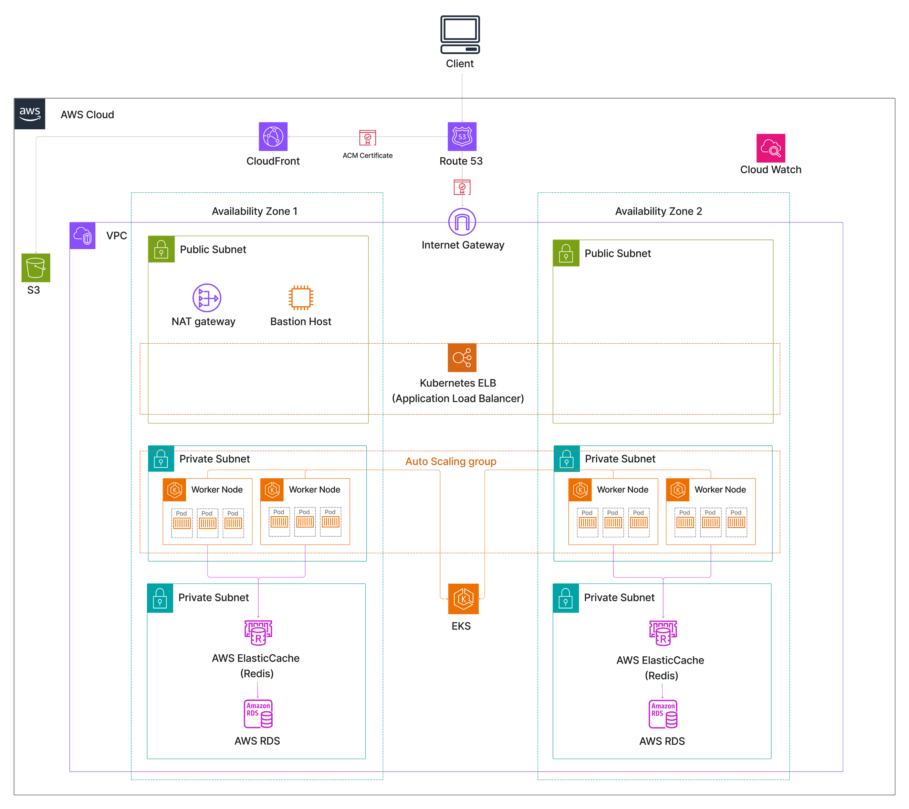

### EKS Architecture

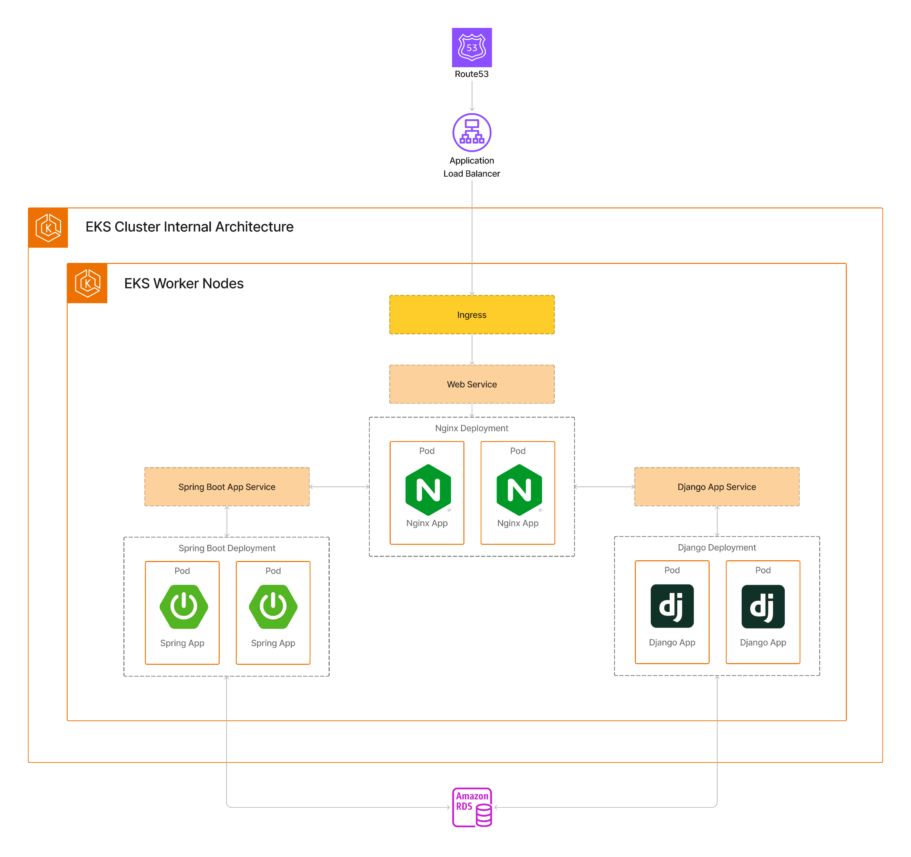

## CICD Architecture

- CI : Jenkins
- CD : ArgoCD
  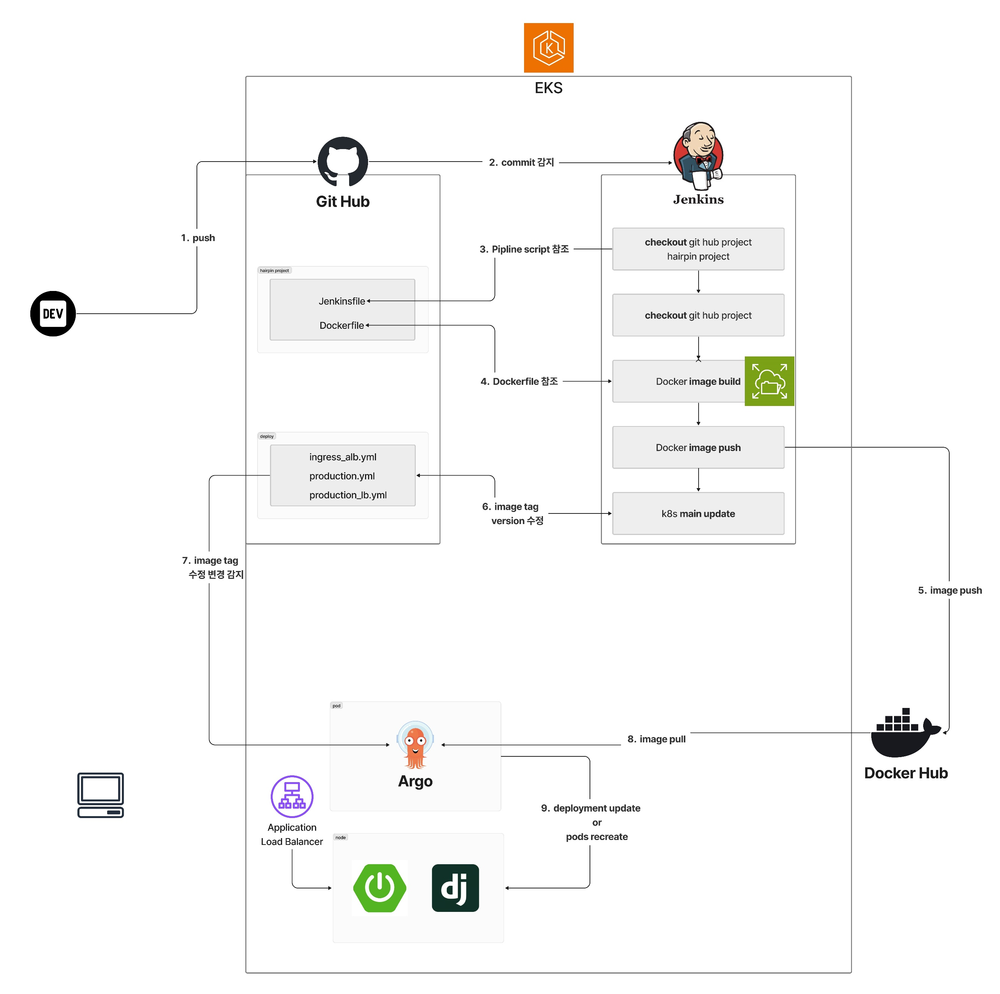

## Terrafrom Architecture

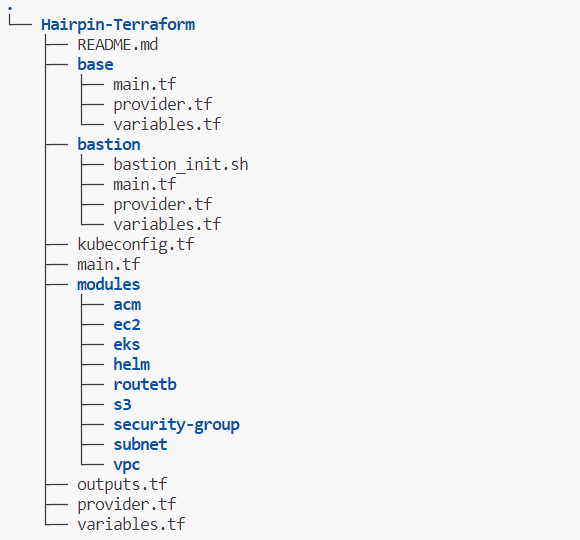

## Web Flow

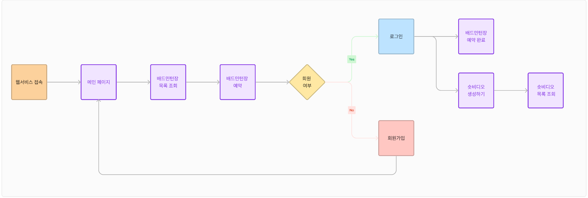

## DB Diagram

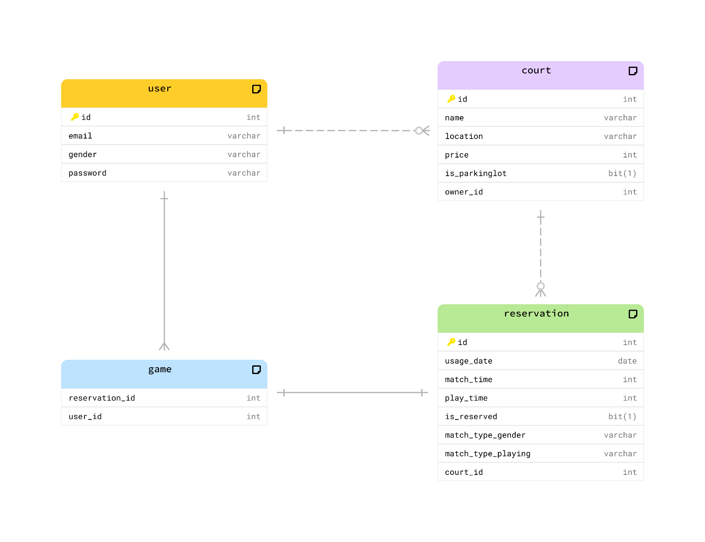

## Page

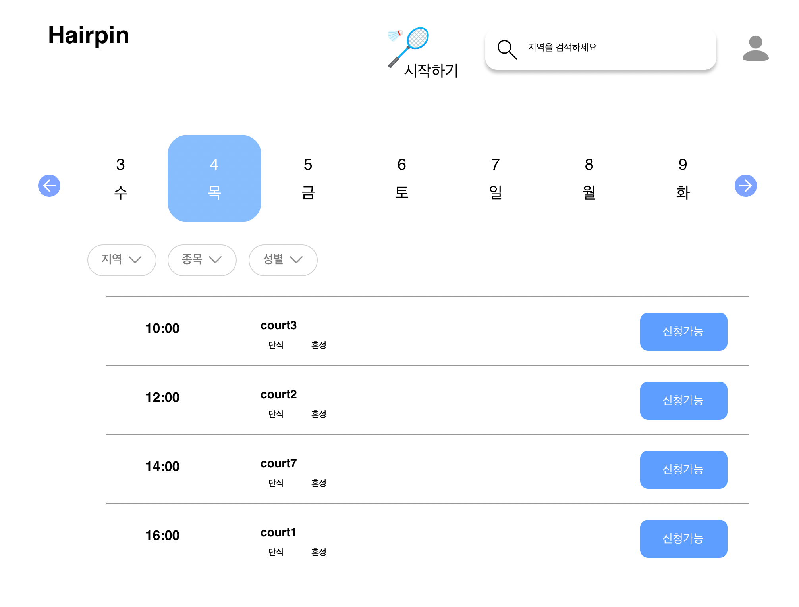
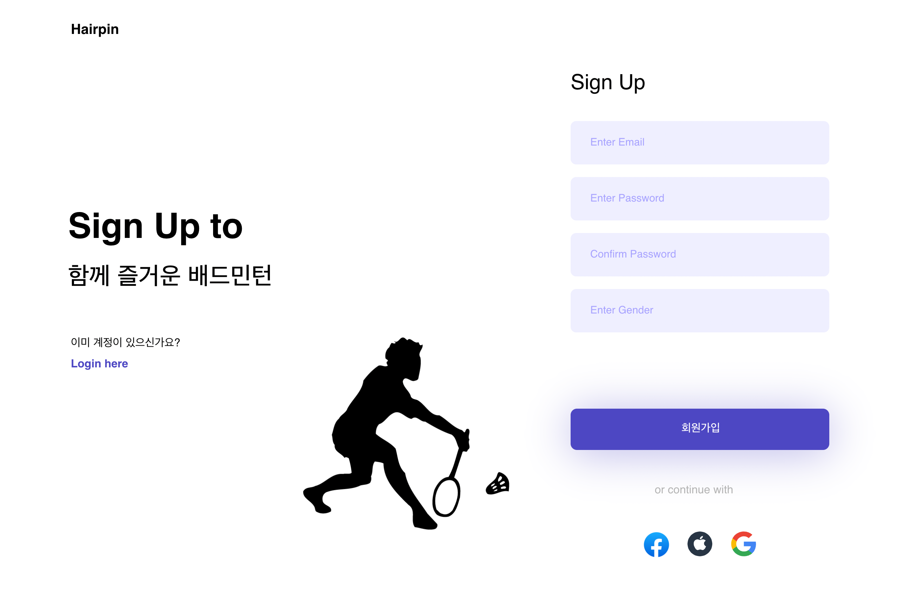
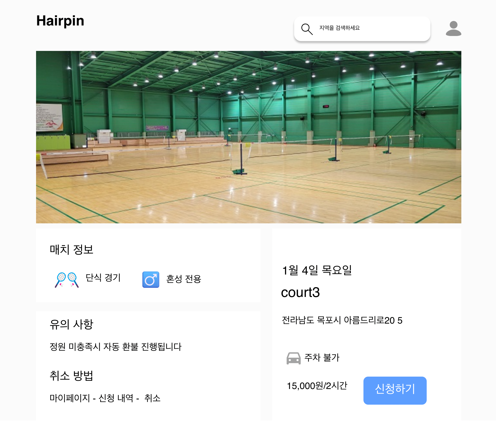
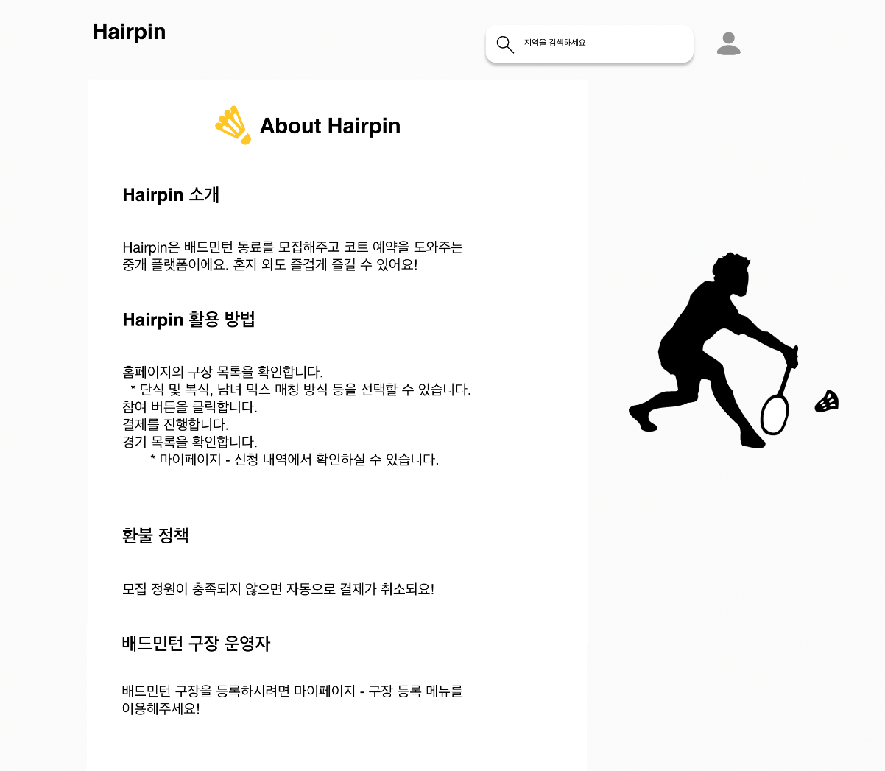
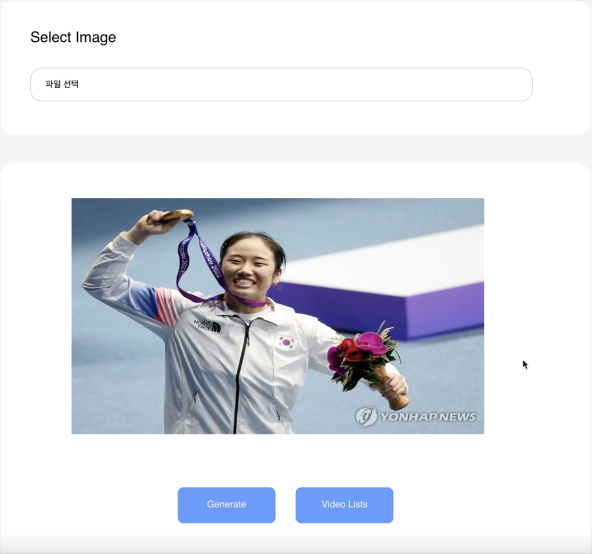

## API specification

- swagger
  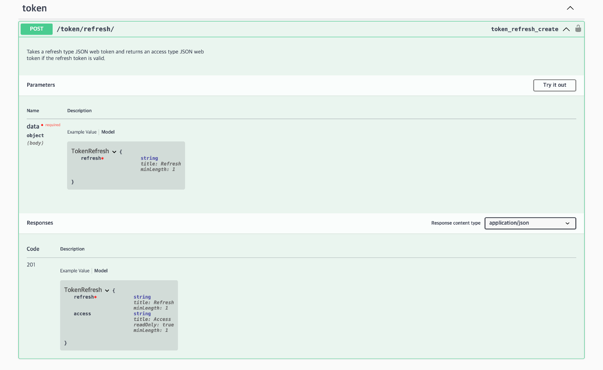
  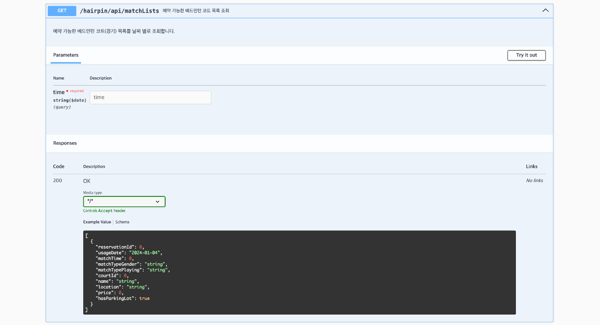
  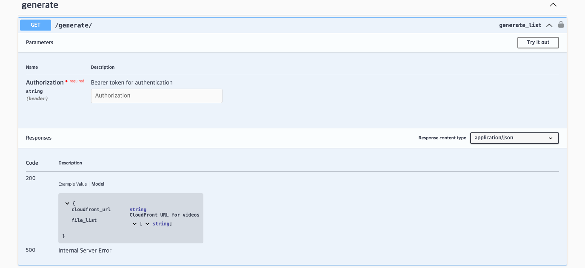

## To Start

`docker run -e DB_URL=[DB_URL] \
-e DB_USERNAME=[DB_USER] \
-e DB_PASSWORD=[DB_PASSWORD] \
-e AUTH_API_URL=[Django_API_URI] \
-p [USER_PORT]:8080 \
yjin9187/hairpin`
